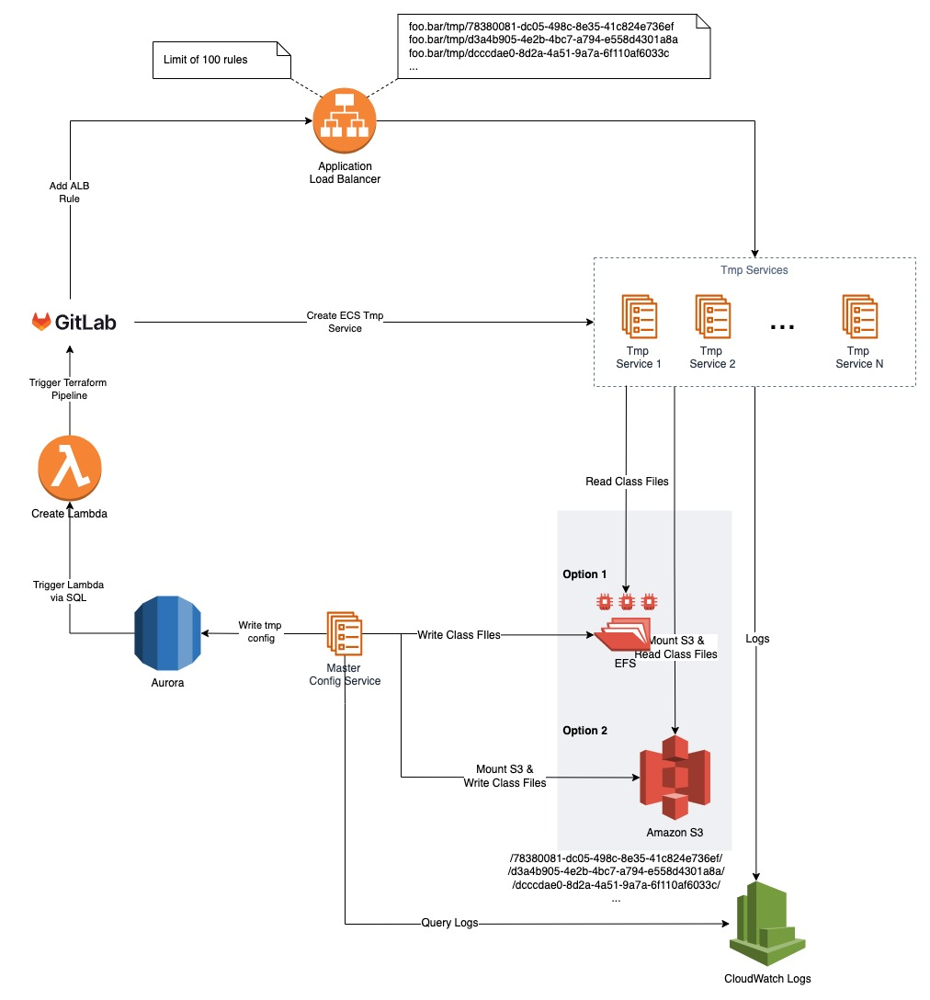

# Create ad hoc ECS services
The Terraform scripts are used to start up an ECS cluster, which creates a Config Service. 
This config service is connected to an ALB and contains a NodeJS Express REST API that can create
ad-hoc ECS Services on the fly over Gitlab.

> **WARNING: This code is just a PoC and not best practice. Most of the issues are marked with a "TODO"**

## Architecture



## REST API
The following endpoints exist in the Config Service:
```
GET /
```
This is the health endpoint.

```
POST /config
Body: user={userId}
```
This is the main endpoint that creates a new ad-hoc ECS service, adds a new routing rule to the ALB
and writes the current timestamp to a file in an EFS service folder for this service.

```
GET /config/:serviceId
```
Returns the content of the EFS file for the given serviceId.

```
DELETE /config/:serviceId
```
Stop to write to the file for the given serviceId.


The ad-hoc service will mount his service folder from EFS and listen to file changes.
When the file changes the content is logged.

## Tmp Service Repository
You can find the Tmp Service repository under https://github.com/DennisCreutz/tmp-service.git